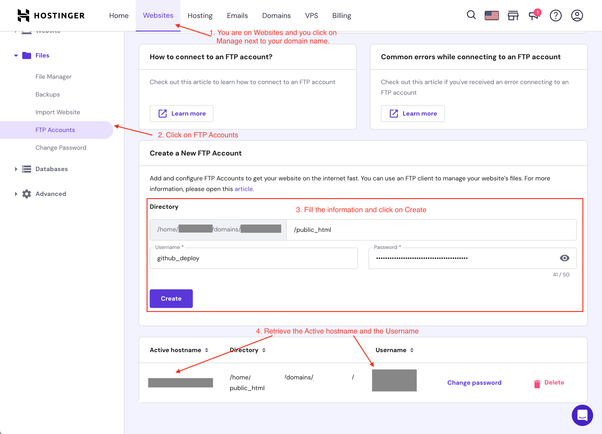
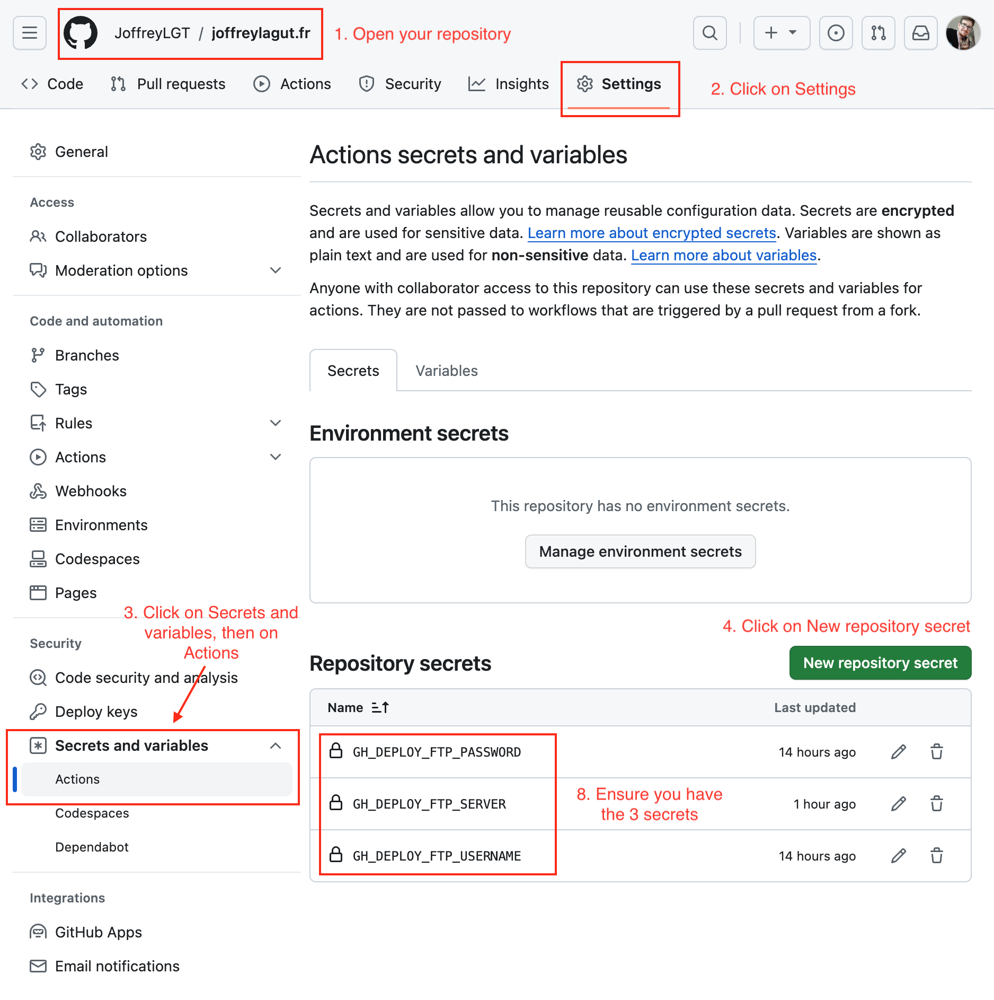

## Context
I decided to host this website using the web hosting provider called [Hostinger](https://www.hostinger.fr/) since they are already hosting some of my websites. Since [joffreylagut.fr](https://joffreylagut.fr) is a plain HTML website generated using [Astro.build](https://astro.build), updating it is in 2 steps:
	1. Build the website using `astro build`: all files are generated into a directory called `dist` (*which can be changed using an argument*).
	2. Open an **FTP** session to the server and drag and drop the content of the `dist` directory.

To save time, avoid any human error or forget to deploy the website every release, we are going to **automatize the deployment** using **continuous deployment (CD)** with [Github Actions](https://github.com/features/actions).

## Steps
### Create a FTP account for your website on Hostinger
From a security perspective, it's always best to create account for specific tasks so you can monitor what is done and restrict their access rights. In our case, Github servers will be able to open an FTP session to the Hostinger server hosting our website, which is why we are creating a new account. If tomorrow we decide not to use Github actions anymore, we can simply delete the FTP account.

Let's create a new FTP account on Hostinger:
1. Open [Hostinger's hpanel](https://hpanel.hostinger.com/websites-list) and login. Then, click on *Websites* > *Manage* (on the website to manage). In the left sidebar of the newly opened page, click on *Files* > *FTP Accounts*.
2. Fill the form in the section *Create a new FTP Account* with the information bellow:
	- Keep `/public_html` as the directory.
	- Set username, password and click on *Create*.
3. Get the information regarding `hostname` and `username` in the section bellow the form.
4. (facultative) Test the credentials with a FTP client like [Filezilla](https://filezilla-project.org/) to ensure it works.

> Tip: Use a password vault (Keepass, Bitwarden etc.) to generate a strong password and save your credentials securely.


*Steps to create a new FTP account on Hostinger*

### Insert the credentials as secrets on Github
From a security perspective, you should never store credentials or sensitive information in unencrypted files. However, the Github servers must have access to our FTP credentials to update our website. Therefore, we are going to use [action secrets](https://docs.github.com/fr/actions/security-guides/using-secrets-in-github-actions): variables defined in the repository (*or in an organisation*) that can be read only by actions and updates by the repository owner.

Let's add our repository secrets:
1. Open your Github repository
2. Go to *Settings*
3. Click on *Secrets and variables* > *Actions*
4. Click *New repository secret*
5. Set the field *Name* as `GH_DEPLOY_FTP_USERNAME`, the field *Secret* with the username of your FTP account and then click on *Add secret*.
6. Repeat step 2 with *Name* as `GH_DEPLOY_FTP_PASSWORD` and the FTP account password as *Secret*
7. Repeat step 2 with *Name* as `GH_DEPLOY_SERVER` and the FTP server hostname as *Secret*
8. Ensure you have the 3 secrets properly configured.


*Steps to configure Github actions secrets*

### Create the Github Actions workflow
#### Workflow file
We now have everything we need to write the deployment workflow. At the root of your project, create a new directory `.github/workflows` and a file `deploy.yml`. Open this file in your favorite text editor.

```shell
mkdir -p .github/workflows && touch .github/workflows/deploy.yml
```

The final code is available [on my repository.](https://github.com/JoffreyLGT/joffreylagut.fr/blob/8d5ffbbe09c07dcb28b87a0e09d169ca459cf6f6/.github/workflows/deploy.yml) 
You can copy/paste the code bellow in `deploy.yml`. It will be described in the next sections:
```yml
name: Deploy website to Hostinger
on:
  workflow_dispatch: # Allow manual run from Github
  release: # Run automatically when a new release is published
    types: [published]
jobs:
  build:
    runs-on: ubuntu-latest
    env:
      # Set the same versions as your own to ensure your project
      # build without issues.
      node-version: 20
      pnpm-version: 8
    steps:
      - name: 🗂️ Checkout repository
        uses: actions/checkout@v3

      - name: 🔨 Install and setup pnpm ${{ env.pnpm-version }}
        uses: pnpm/action-setup@v2 
        with:
          version: ${{ env.pnpm-version }}
      - name: 🔧 Install and setup Node.js ${{ env.node-version }}
        uses: actions/setup-node@v3
        with:
          node-version: ${{ env.node-version }}
          cache: 'pnpm'

      - name: 🛠️ Install dependencies
        run: pnpm install

      - name: 🛠️ Build application 
        run: pnpm run build

      - name: 📂 Sync files with FTP server
        uses: SamKirkland/FTP-Deploy-Action@v4.3.4
        with:
          server: ${{ secrets.GH_DEPLOY_FTP_SERVER }}
          username: ${{ secrets.GH_DEPLOY_FTP_USERNAME }}
          password: ${{ secrets.GH_DEPLOY_FTP_PASSWORD }}
          port: 21 # Change if necessary
          local-dir: ./dist/ # Change if necessary
``` 

#### Workflow: setup section
The setup section is pretty straightforward.
```yml
name: Deploy website to Hostinger
on:
  workflow_dispatch: # Allow manual run from Github
  release: # Run automatically when a new release is published
    types: [published]
jobs:
  build:
    runs-on: ubuntu-latest
    env:
      # Set the same versions as your own to ensure your project
      # build without issues.
      node-version: 20
      pnpm-version: 8
```

- `name` is displayed on Github Actions to identify the workflow
- `on` defines what event should trigger the workflow ; we want to start it manually and when we publish a new release
- `jobs` is where we can setup the "actions" we want to do ; we have only one, `build` since we only want to build and publish the website
- `runs-on` defines the operating system of the VM used to run the job
- `env` are environment variables we want to reuse in the steps ; here we can easily change our node and pnpm version

#### Workflow: steps
The file having a lot of comments and defined names, I'm not gonna describe each line here.
```yml
    steps:
      - name: 🗂️ Checkout repository
        uses: actions/checkout@v3

      - name: 🔨 Install and setup pnpm ${{ env.pnpm-version }}
        uses: pnpm/action-setup@v2 
        with:
          version: ${{ env.pnpm-version }}
      - name: 🔧 Install and setup Node.js ${{ env.node-version }}
        uses: actions/setup-node@v3
        with:
          node-version: ${{ env.node-version }}
          cache: 'pnpm'

      - name: 🛠️ Install dependencies
        run: pnpm install

      - name: 🛠️ Build application 
        run: pnpm run build

      - name: 📂 Sync files with FTP server
        uses: SamKirkland/FTP-Deploy-Action@v4.3.4
        with:
          server: ${{ secrets.GH_DEPLOY_FTP_SERVER }}
          username: ${{ secrets.GH_DEPLOY_FTP_USERNAME }}
          password: ${{ secrets.GH_DEPLOY_FTP_PASSWORD }}
          port: 21 # Change if necessary
          local-dir: ./dist/ # Change if necessary
```
There are two types of steps:
- Commands, which are defined with the keyword `run` and used to run command lines
- Predefined steps defined with the keyword `uses` to run actions available on the [Github Actions Marketplace](https://github.com/marketplace?type=actions)

In addition, we notice two important informations:
1. `${{ env.node-version }}` and `${{ env.pnpm-version }}` are replaced by the values of the setup section.
2. `${{ secrets.GH_DEPLOY_FTP_SERVER }}`, `${{ secrets.GH_DEPLOY_FTP_USERNAME }}` and `${{ secrets.GH_DEPLOY_FTP_PASSWORD }}` fetches the actions secrets we defined before.

#### I am not using `pnpm`, how do I make it work?
`pnpm` is a packet manager. Therefore, you can replace it with your own by changing the steps `🔨 Install and setup pnpm`, `🛠️ Install dependencies` and `🛠️ Build application` with your own.
### References
- [FTP Deploy action](https://github.com/SamKirkland/FTP-Deploy-Action)
- [Astro deployment using Github Actions](https://docs.astro.build/en/guides/deploy/aws/#continuous-deployment-with-github-actions)
- [Using PNPM with continuous integration](https://pnpm.io/continuous-integration)
