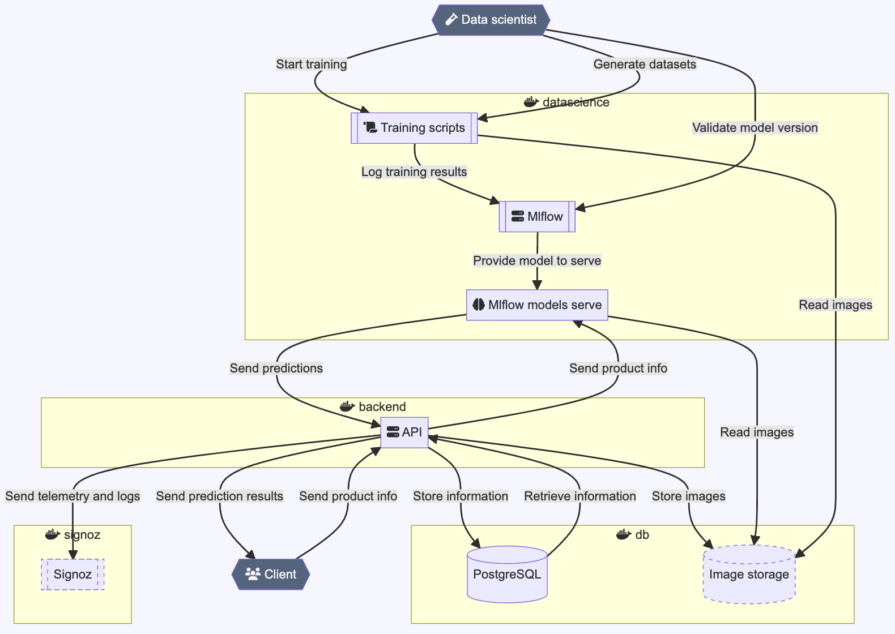

## Table of content
- [Elevator pitch](#elevator-pitch) 
- [Features](#features)
- [Technical environment](#technical-environment)
- [Architecture diagram](#architecture-diagram)
- [Context](#context)
- [Resources](#resources)

## Elevator pitch
Are your online store customers having trouble finding what they're looking for because of poor product categorization?  
Would you like to improve your customers' shopping experience?

Call on Reagan: the autonomous product classification platform!

It integrates with your information system and uses advanced artificial intelligence models to make predictions.
There's no need to have any knowledge of data science: once configured, Reagan learns automatically to always ensure an excellent level of performance and awareness of the products offered for sale on your store.

Want to give it a try? [Go to Github](https://github.com/JoffreyLGT/e-commerce-mlops) or consult the [documentation](https://joffreylgt.github.io/e-commerce-mlops/).

## Features
- Documented prediction API based on [OpenAPI (Swagger)](https://github.com/OAI/OpenAPI-Specification) and [JSON Schema](https://json-schema.org/) standards.
- Deep learning models pre-trained on 84,000 products in 27 categories.
- Simple configuration via text file.
- Advanced monitoring:
	- Model performance and training.
	- Prediction API performance.
- Automatic model training and production.
- Centralized logs and telemetry.

The platform can operate in two ways:

1. Stand-alone: deploys all components for optimal operation, including data storage and log centralization.
2. Integrated: deploys only model-related components and uses your servers for training data retrieval and log centralization.

## Technical environment
- Libraries: [Pydantic](https://docs.pydantic.dev/latest/), [FastAPI](https://fastapi.tiangolo.com/), [MLFlow](https://mlflow.org/), [Tensorflow](https://www.tensorflow.org/?hl=fr), [OpenTelemetry](https://opentelemetry.io/)
- Integrated solutions: [Signoz](https://signoz.io/), [MLFlow model registry](https://mlflow.org/docs/latest/model-registry.html), [Tensorboard](https://www.tensorflow.org/tensorboard?hl=fr), [Quartz](https://quartz.jzhao.xyz/)
- System environment : [Docker](https://www.docker.com/), [Kubernete](https://kubernetes.io/fr/), [Github Actions](https://github.com/features/actions), [PostgreSQL](https://www.postgresql.org/)
- Dev environment: [Python 3.11](https://www.python.org/), [Poetry](https://python-poetry.org/), [VSCode Dev Container](https://code.visualstudio.com/docs/devcontainers/containers), [Mypy](https://mypy-lang.org/), [Ruff](https://docs.astral.sh/ruff/), [Black](https://github.com/psf/black), [pre-commit](https://pre-commit.com/), [Conventional commit](https://www.conventionalcommits.org/)

## Architecture diagram
*Note: this diagram doesn't mention any container scaling.*

## Context
This project was initiated during my [DataScientest MLOps](https://datascientest.com/formation-ml-ops) training, which is part of my [Machine Learning Engineer](/cv)'s degree. However, it has gone beyond the expected scope to become a modular solution.

It was presented to a panel of judges at a presentation to validate my skills.

Development is still in progress at a slow pace. My idea is to use it as a template to bootstrap other machine learning project I could have.

## Resources

- [Code source](https://github.com/JoffreyLGT/e-commerce-mlops)
- [Documentation](https://joffreylgt.github.io/e-commerce-mlops/)
